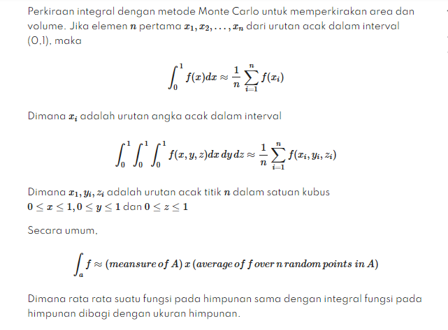
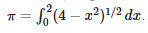
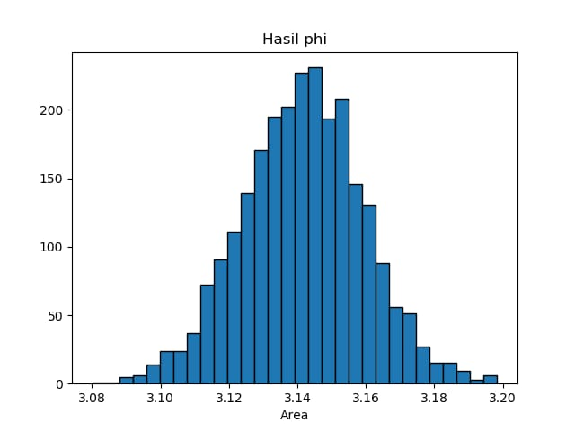
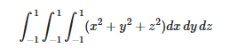

# Metode Monte Carlo

> Metode Monte Carlo adalah algoritma komputasi yang mengandalkan pengambilan sampel acak berulang untuk mendapatkan hasil numerik. Penggunaan metode ini adalah untuk mengevaluasi integral definit, terutama integral multidimensi dengan syarat dan batasan yang rumit.

Metode ini terbukti efisien dalam memecahkan persamaan diferensial integral medan radians, sehingga metode ini digunakan dalam perhitungan iluminasi global yang menghasilkan gambar-gambar fotorealistik model tiga dimensi, dimana diterapkan dalam video games, arsitektur, perancangan, film yang dihasilkan oleh komputer, efek-efek khusus dalam film, bisnis, ekonomi, dan bidang lainnya.
Karena algoritma ini memerlukan pengulangan (repetisi) dan perhitungan yang amat kompleks, metode Monte Carlo pada umumnya dilakukan menggunakan komputer, dan memakai berbagai teknik simulasi komputer.

### Estimation of Areas and Volumes by Monte Carlo



### Langkah-langkah metode Monte Carlo

1.  Mendefinisikan distribusi probabilitas dati datamasa lalu atau dari distribusi teoritis.
2. Mengkonversikan distribusi kedalam frekuensikumulatif.
3. Melakukan simulasi dengan bilangan acak.
4. Menganalisa keluaran simulasi.

### Tugas Pemrograman

3. Buatlah program untuk memverifikasi secara numerik bahwa Gunakan metode monte carlo dan 2500 angka acak.  

##### Listing Program 


```python

from scipy import random
import numpy as np
import matplotlib.pyplot as plt

b = 0
a = 2
n = 2500
def fungsi(x):
    return (4-x**2)**0.5

area = []
for i in range(n):
    xacak = np.zeros(n)

    for i in range(len(xacak)):
        xacak[i] = random.uniform(b,a)
        integral = 0.0

    for i in range(n):
        integral+=fungsi(xacak[i])

    jawab = (a-b)/float(n)*integral
    area.append(jawab)

plt.title("Hasil phi")
plt.hist(area,bins = 30, ec = 'black')
plt.xlabel("Area")
plt.show()
```


##### Hasil Program 



4. Gunakan metode monte carlo untuk memperkirakan integral



##### Listing Program 

```py
from scipy import random
import numpy as np

a = -1
b = 1
N=100
xrand=np.zeros(N)
yrand=np.zeros(N)
zrand=np.zeros(N)
integral=0.0
for i in range(4):
    for i in range(len(xrand)):
        xrand[i]=random.uniform(a,b)

    for i in range(len(yrand)):
        yrand[i]=random.uniform(a,b)

    for i in range(len(zrand)):
        zrand[i]=random.uniform(a,b)

    def func(x,y,z):
        return (x**2)+(y**2)+(z**2)


    for i in range(N):
        integral+=func(xrand[i],yrand[i],zrand[i])

jawab=(b-a)/float(N)*integral
print("jawab: ",jawab)
```


##### Hasil program

```python
jawab:  7.951233160381278
```


